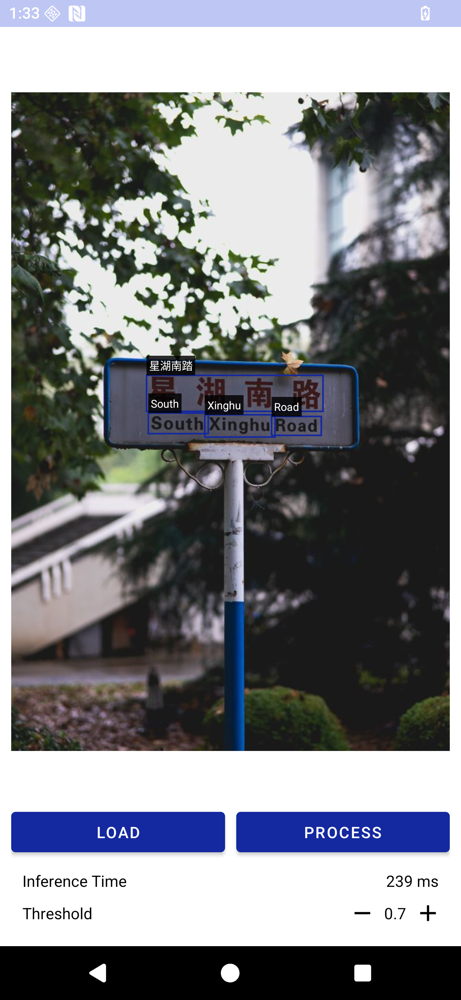

# Object Detection In Android
This document describes a method to operate Android sample application using the [EasyOCR](https://soc-developer.semiconductor.samsung.com/global/solution/AI?models-page=1&project-page=1&models-categoryId=7bdcccc8-5584-4a06-bec6-cc3293e05cf1) model that is optimized for Exynos hardware.

## Functionality
This sample application performs Optical Character Recognition(OCR) on images captured from the camera or loaded from the device gallery.

The application consists of two neural network models: a decoder that detects text regions and a recognizer that recognizes the detected text.

Detected text regions are highlighted with bounding boxes, and the recognized text is displayed.

  

## Getting Started
Perform the following steps to utilize the sample application:
1.	Download or clone the sample application from this repository.
2.  If there is no device available to run the application, you can use the actual devices provided in the AI Studio Farm.
    For more information on connecting a device to Android Studio, refer to ADB Client Proxy.
3.  Use adb push command to push a sample image to the following path for testing.
4.  Select Tools → Device Manager in Android Studio. Please verify whether the physical device is properly connected.
5.  Run the image to text project from the sample applications obtained through git clone in Android Studio.
6.  Upload the image data for inference and execute the application.
7.  Press **PROCESS** to perform OCR inference.

Perform the following steps to modify the model used in the sample application:
1.	Copy the desired model file to the `assets` directory of the project.
2.	Copy the corresponding label text file to the `assets` directory.
3.	Modify the parameters in the ModelConstants.kt file to reflect the specifications of the new model.
4.	If the inputs and outputs of the model differ from the pre-designed sample application, modify the `preProcess()`, `postProcess()` and `convertBitmapToFloatArray()` functions.

## Compatible AI Models
Below is a list of models expected to be compatible with the sample application.  
**Note:** All models that are listed here are not individually tested with this application.  
[MMOCR](https://soc-developer.semiconductor.samsung.com/global/solution/AI?models-page=1&project-page=1&models-categoryId=7bdcccc8-5584-4a06-bec6-cc3293e05cf1)
