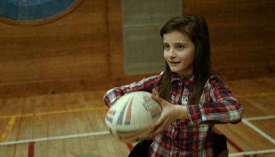
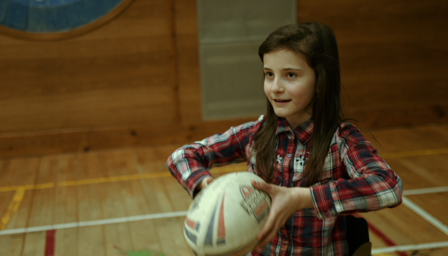
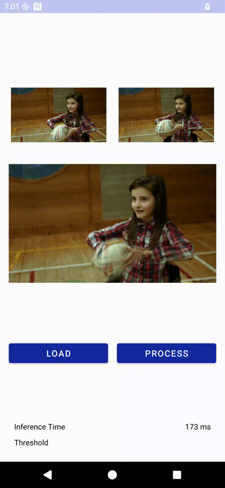

# Video Enhancement In Android
This document describes a method to operate Android sample application using the [RIFE](https://soc-developer.semiconductor.samsung.com/global/solution/AI?models-page=1&project-page=1&models-categoryId=7bdcccc8-5584-4a06-bec6-cc3293e05cf1) model that is optimized for Exynos hardware.

## Functionality
This application performs **video frame interpolation** by generating an intermediate frame between two input images. Users can select two consecutive frames, execute the RIFE model, and preview the interpolation result as an animated sequence.

<table align="center">
<tr>
<td align="center">
 
<b>Input Image 1</b>
</td>

<td align="center">
 
<b>Input Image 2</b>
</td>
</tr>

<tr>
<td colspan="2" align="center">
 
<b>Interpolated Result</b>
</td>
</tr>
</table>

## Getting Started
Perform the following steps to utilize the sample application:
1. Download or clone the sample application from this repository.
2. If there is no device available to run the application, you can use the actual devices provided in the AI Studio Farm.
    For more information on connecting a device to Android Studio, refer to ADB Client Proxy.
3. Use adb push command to push a sample image to the following path for testing.
4. Select Tools → Device Manager in Android Studio. Please verify whether the physical device is properly connected.
5. Run the video enhancement project from the sample applications obtained through git clone in Android Studio.
6. Press LOAD and select the first input image.
7. Press LOAD again and select the second input image.
8. Press PROCESS to perform frame interpolation.
9. The generated intermediate frame is displayed as an animated preview together with the two input images.

Perform the following steps to modify the model used in the sample application:
1.	Copy the desired model file to the `assets` directory of the project.
2.	Copy the corresponding label text file to the `assets` directory.
3.	Modify the parameters in the ModelConstants.kt file to reflect the specifications of the new model.
4.	If the inputs and outputs of the model differ from the pre-designed sample application, modify the `preProcess()`, `postProcess()` and `convertBitmapToFloatArray()` functions.

## Compatible AI Models
Below is a list of models expected to be compatible with the sample application.  
**Note:** All models that are listed here are not individually tested with this application.
